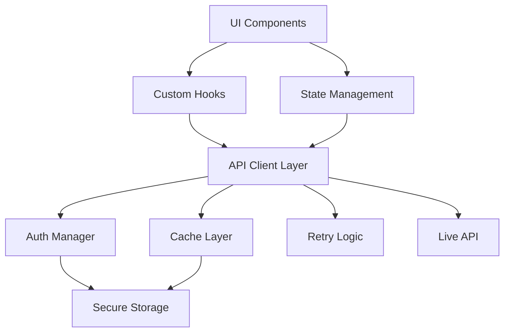
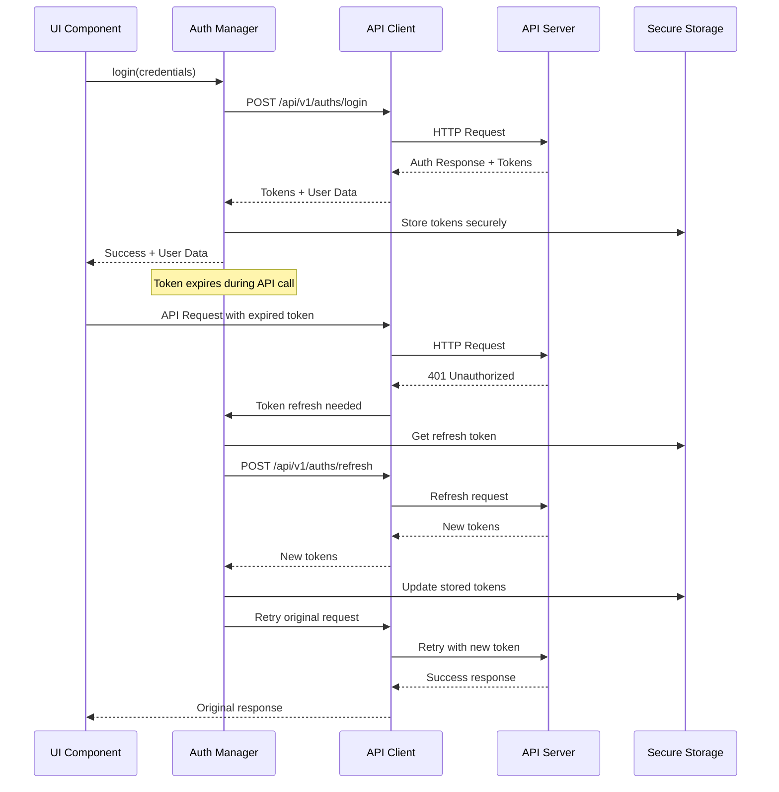

# Design Document

## Overview

This design document outlines the architecture and implementation strategy for integrating the HireGen frontend with the live HR Talent Agent System API. The design focuses on creating a robust, scalable, and maintainable API client layer while preserving the existing user experience and adding comprehensive error handling, authentication management, and state synchronization.

## Architecture

### High-Level Architecture



### API Client Architecture

The API client will be structured in layers:

1. **Transport Layer**: HTTP client with interceptors
2. **Authentication Layer**: Token management and refresh logic
3. **Service Layer**: Endpoint-specific API methods
4. **Cache Layer**: Request/response caching and deduplication
5. **Error Handling Layer**: Centralized error processing and retry logic

## Components and Interfaces

### 1. API Client Core

```typescript
// lib/api/client.ts
interface APIClient {
  auth: AuthService
  users: UsersService
  subscriptions: SubscriptionsService
  search: SearchService
  coreSignal: CoreSignalService
  cache: CacheService
  agents: AgentsService
  monitoring: MonitoringService
  chat: ChatService
}

interface APIConfig {
  baseURL: string
  timeout: number
  retryAttempts: number
  retryDelay: number
  useLiveAPI: boolean
}
```

### 2. Authentication Manager

```typescript
// lib/api/auth.ts
interface AuthManager {
  login(credentials: LoginCredentials): Promise<AuthResponse>
  logout(): Promise<void>
  refreshToken(): Promise<AuthResponse>
  getAccessToken(): string | null
  isAuthenticated(): boolean
  onTokenExpired(callback: () => void): void
}

interface AuthResponse {
  access_token: string
  refresh_token: string
  token_type: string
  session_id: string
  user: UserProfile
}
```

### 3. Service Interfaces

```typescript
// lib/api/services/search.ts
interface SearchService {
  search(request: SearchRequest): Promise<SearchResults>
  getResults(searchId: string, userId: string): Promise<SearchResults>
  refineSearch(searchId: string, request: SearchRequest): Promise<SearchResults>
  getReport(searchId: string, userId: string): Promise<SearchReport>
  getHistory(userId: string, pagination: Pagination): Promise<SearchHistoryItem[]>
  testConnection(): Promise<boolean>
}
```

### 4. State Management

```typescript
// lib/store/slices/auth.ts
interface AuthState {
  user: UserProfile | null
  isAuthenticated: boolean
  isLoading: boolean
  error: string | null
  tokens: {
    access_token: string | null
    refresh_token: string | null
  }
}

// lib/store/slices/search.ts
interface SearchState {
  currentSearch: SearchResults | null
  searchHistory: SearchHistoryItem[]
  isSearching: boolean
  searchProgress: SearchProgress | null
  error: string | null
}
```

### 5. Custom Hooks

```typescript
// hooks/useAuth.ts
interface UseAuthReturn {
  user: UserProfile | null
  login: (credentials: LoginCredentials) => Promise<void>
  logout: () => Promise<void>
  isAuthenticated: boolean
  isLoading: boolean
  error: string | null
}

// hooks/useSearch.ts
interface UseSearchReturn {
  search: (query: string) => Promise<void>
  results: SearchResults | null
  refineSearch: (criteria: SearchCriteria) => Promise<void>
  isSearching: boolean
  progress: SearchProgress | null
  error: string | null
}

// hooks/useChat.ts
interface UseChatReturn {
  sendMessage: (message: string) => Promise<void>
  messages: ChatMessage[]
  isLoading: boolean
  error: string | null
  sessionId: string | null
  suggestedActions: SuggestedAction[]
  clearSession: () => Promise<void>
}
```

### 6. Chat Agent Integration Strategy

The Chat Agent will be implemented using a **progressive enhancement approach** with feature flags:

```typescript
// lib/api/chat/types.ts
export type ResponseType = 'chat' | 'search_analysis' | 'talent_details' | 'web_search' | 'candidate_research'
export type SuggestedAction = 'research_candidate' | 'analyze_skills' | 'compare_candidates'

export interface ChatRequest {
  message: string
  session_id?: string
  temperature?: number // default 0.7
}

export interface ChatResponse {
  message: string
  session_id: string
  user_id: string
  suggested_actions?: SuggestedAction[]
  response_type: ResponseType
  search_history_summary?: SearchHistorySummary
  errors?: string[]
}

export interface TopCandidateSummary {
  name: string
  position: string
  overall_score: number
  relevance_score: number
  skills_score: number
  experience_score: number
  location_score: number
  linkedin_url?: string
  matched_skills?: string[]
  missing_skills?: string[]
  recent_companies?: string[]
  key_achievements?: string[]
}

export interface SearchHistorySummary {
  total_searches: number
  recent_searches?: any[]
  total_results_found?: number
  top_candidates?: TopCandidateSummary[]
}
```

### Chat Client Implementation

```typescript
// lib/api/chat/chatClient.ts
const CHAT_ENABLED = process.env.NEXT_PUBLIC_CHAT_AGENT_ENABLED === 'true'

export class ChatClient {
  async chat(request: ChatRequest): Promise<ChatResponse> {
    if (!CHAT_ENABLED) return this.mockChat(request)
    
    // Real implementation - swap when backend ready
    const response = await fetch('/api/v1/chat/chat', {
      method: 'POST',
      headers: {
        'Content-Type': 'application/json',
        'Authorization': `Bearer ${this.getToken()}`
      },
      body: JSON.stringify(request)
    })
    
    if (!response.ok) throw new Error(`Chat failed: ${response.status}`)
    return response.json()
  }

  private mockChat(request: ChatRequest): ChatResponse {
    // Rich mock data matching Gideon's specification
    return {
      message: this.generateMockResponse(request.message),
      session_id: 'preview-session',
      user_id: 'current-user',
      response_type: this.inferResponseType(request.message),
      suggested_actions: ['research_candidate', 'compare_candidates'],
      search_history_summary: {
        total_searches: 5,
        total_results_found: 47,
        top_candidates: [
          {
            name: "Ava Patel",
            position: "Senior Frontend Engineer",
            overall_score: 97,
            relevance_score: 85,
            skills_score: 90,
            experience_score: 95,
            location_score: 80,
            linkedin_url: "https://linkedin.com/in/avapatel",
            matched_skills: ["React", "TypeScript", "GraphQL"],
            missing_skills: ["Vue.js"],
            recent_companies: ["Shopify", "Atlassian"],
            key_achievements: ["Led TypeScript migration", "Improved Lighthouse scores by 30%"]
          }
        ]
      },
      errors: []
    }
  }

  private generateMockResponse(message: string): string {
    if (message.toLowerCase().includes('ranking') || message.toLowerCase().includes('score')) {
      return "Based on your recent search, Ava Patel was ranked #1 with a 97% match score. Her high ranking comes from: 85% relevance (perfect React/TypeScript match), 90% skills score (strong in your required technologies), 95% experience score (7 years with leadership at top companies), and 80% location score (Toronto, good timezone overlap)."
    }
    if (message.toLowerCase().includes('candidate') || message.toLowerCase().includes('profile')) {
      return "I found detailed information about your top candidates. Ava Patel stands out with her experience at Shopify leading frontend architecture. She's actively looking and available immediately. Would you like me to analyze her specific achievements or compare her with other candidates?"
    }
    return `I can help you analyze your search results and candidates. Based on your query "${message}", I can provide insights about candidate rankings, detailed profiles, or help you understand the scoring methodology.`
  }

  private inferResponseType(message: string): ResponseType {
    if (message.toLowerCase().includes('ranking') || message.toLowerCase().includes('score')) return 'search_analysis'
    if (message.toLowerCase().includes('candidate') || message.toLowerCase().includes('profile')) return 'talent_details'
    if (message.toLowerCase().includes('research') || message.toLowerCase().includes('find')) return 'web_search'
    return 'chat'
  }

  private getToken(): string {
    return localStorage.getItem('access_token') || ''
  }
}
```

## Data Models

### 1. API Response Types

Based on the OpenAPI specification, we'll generate TypeScript types for all API responses:

```typescript
// lib/api/types/generated.ts
// Auto-generated from OpenAPI spec
export interface SearchResults {
  search_id: string
  user_id: string
  search_request: SearchRequest
  results: RankedTalentProfile[]
  total_results: number
  search_duration: number
  timestamp: string
  search_summary: string
  recommendations: string[]
}

export interface RankedTalentProfile {
  id: number
  full_name: string
  headline: string
  linkedin_url: string
  relevance_score: number
  skill_match_score: number
  experience_score: number
  location_score: number
  // ... other fields
}
```

### 2. Application State Types

```typescript
// lib/types/app.ts
export interface AppConfig {
  api: {
    baseURL: string
    timeout: number
    useLiveAPI: boolean
  }
  features: {
    enableChat: boolean
    enableCoreSignal: boolean
    enableMonitoring: boolean
  }
}

export interface SearchProgress {
  stage: 'initializing' | 'searching' | 'ranking' | 'complete'
  progress: number
  message: string
  estimatedTimeRemaining?: number
}
```

## Error Handling

### Error Classification

```typescript
// lib/api/errors.ts
export enum APIErrorType {
  NETWORK_ERROR = 'NETWORK_ERROR',
  AUTHENTICATION_ERROR = 'AUTHENTICATION_ERROR',
  AUTHORIZATION_ERROR = 'AUTHORIZATION_ERROR',
  VALIDATION_ERROR = 'VALIDATION_ERROR',
  RATE_LIMIT_ERROR = 'RATE_LIMIT_ERROR',
  SERVER_ERROR = 'SERVER_ERROR',
  TIMEOUT_ERROR = 'TIMEOUT_ERROR'
}

export class APIError extends Error {
  constructor(
    public type: APIErrorType,
    public message: string,
    public statusCode?: number,
    public details?: any
  ) {
    super(message)
  }
}
```

### Error Handling Strategy

1. **Network Errors**: Retry with exponential backoff
2. **Authentication Errors**: Attempt token refresh, then redirect to login
3. **Validation Errors**: Display field-specific error messages
4. **Rate Limiting**: Queue requests and show user feedback
5. **Server Errors**: Log error, show generic message, provide retry option

### Retry Logic

```typescript
// lib/api/retry.ts
interface RetryConfig {
  maxAttempts: number
  baseDelay: number
  maxDelay: number
  backoffFactor: number
  retryableErrors: APIErrorType[]
}

const defaultRetryConfig: RetryConfig = {
  maxAttempts: 3,
  baseDelay: 1000,
  maxDelay: 10000,
  backoffFactor: 2,
  retryableErrors: [
    APIErrorType.NETWORK_ERROR,
    APIErrorType.TIMEOUT_ERROR,
    APIErrorType.SERVER_ERROR
  ]
}
```

## Authentication Flow

### Token Management



### Session Management

- Access tokens stored in memory for security
- Refresh tokens stored in httpOnly cookies or secure storage
- Automatic token refresh before expiration
- Session cleanup on logout or tab close

## Caching Strategy

### Cache Layers

1. **HTTP Cache**: Browser-level caching for static resources
2. **Memory Cache**: In-memory caching for frequently accessed data
3. **Persistent Cache**: IndexedDB for offline capability
4. **Request Deduplication**: Prevent duplicate simultaneous requests

### Cache Implementation

```typescript
// lib/api/cache.ts
interface CacheConfig {
  ttl: number // Time to live in milliseconds
  maxSize: number // Maximum cache entries
  strategy: 'lru' | 'fifo' // Eviction strategy
}

interface CacheEntry<T> {
  data: T
  timestamp: number
  ttl: number
  key: string
}

class APICache {
  private cache = new Map<string, CacheEntry<any>>()
  
  get<T>(key: string): T | null
  set<T>(key: string, data: T, ttl?: number): void
  invalidate(pattern: string): void
  clear(): void
}
```

### Cache Keys Strategy

- User-specific data: `user:{userId}:endpoint`
- Search results: `search:{searchId}:results`
- Candidate profiles: `candidate:{candidateId}:profile`
- Global data: `global:endpoint`

## State Management

### Store Architecture

Using a combination of React Context and custom hooks for state management:

```typescript
// lib/store/index.ts
interface AppState {
  auth: AuthState
  search: SearchState
  candidates: CandidatesState
  subscriptions: SubscriptionsState
  ui: UIState
}

// Context providers for different domains
export const AuthProvider: React.FC<{ children: React.ReactNode }>
export const SearchProvider: React.FC<{ children: React.ReactNode }>
export const CandidatesProvider: React.FC<{ children: React.ReactNode }>
```

### State Synchronization

- Optimistic updates for better UX
- Conflict resolution for concurrent updates
- Real-time updates via WebSocket (future enhancement)
- Offline support with sync on reconnection

## Testing Strategy

### Unit Testing

- API client methods with mocked responses
- Authentication flow edge cases
- Error handling scenarios
- Cache behavior validation

### Integration Testing

- End-to-end API flows
- Authentication token refresh
- Search and results flow
- Error recovery scenarios

### Mock Strategy

```typescript
// lib/api/mock/index.ts
interface MockConfig {
  enabled: boolean
  delay: number
  errorRate: number
  scenarios: MockScenario[]
}

class MockAPIClient implements APIClient {
  // Implement all service interfaces with mock data
  // Support for different scenarios (success, error, slow response)
}
```

### Test Environment Setup

- Environment variable `USE_LIVE_API=false` for development
- Mock service worker (MSW) for browser testing
- Dedicated test API endpoints for staging
- Automated testing with real API in CI/CD

## Performance Optimization

### Request Optimization

1. **Request Batching**: Combine multiple requests where possible
2. **Pagination**: Implement virtual scrolling for large datasets
3. **Debouncing**: Delay search requests until user stops typing
4. **Prefetching**: Load likely-needed data in advance
5. **Compression**: Enable gzip/brotli compression

### Response Optimization

1. **Selective Loading**: Only fetch required fields
2. **Progressive Loading**: Load critical data first
3. **Background Updates**: Refresh data in background
4. **Lazy Loading**: Load components and data on demand

### Bundle Optimization

1. **Code Splitting**: Split API client by service
2. **Tree Shaking**: Remove unused API methods
3. **Dynamic Imports**: Load services on demand
4. **Service Workers**: Cache API responses offline

## Security Considerations

### Token Security

- Access tokens in memory only (not localStorage)
- Refresh tokens in httpOnly cookies
- Token rotation on each refresh
- Secure token transmission (HTTPS only)

### Request Security

- CSRF protection via custom headers
- Request signing for sensitive operations
- Rate limiting on client side
- Input validation and sanitization

### Data Protection

- Sensitive data encryption at rest
- PII data handling compliance
- Audit logging for data access
- Secure data transmission

## Configuration Management

### Environment Configuration

```typescript
// lib/config/index.ts
interface Config {
  api: {
    baseURL: string
    timeout: number
    retryAttempts: number
  }
  auth: {
    tokenRefreshThreshold: number
    sessionTimeout: number
  }
  cache: {
    defaultTTL: number
    maxSize: number
  }
  features: {
    useLiveAPI: boolean
    enableOffline: boolean
    enableAnalytics: boolean
  }
}

const config: Config = {
  api: {
    baseURL: process.env.NEXT_PUBLIC_API_BASE_URL || 'https://agent-architecture.onrender.com',
    timeout: parseInt(process.env.NEXT_PUBLIC_API_TIMEOUT || '30000'),
    retryAttempts: parseInt(process.env.NEXT_PUBLIC_API_RETRY_ATTEMPTS || '3')
  },
  // ... other config
}
```

### Feature Flags

```typescript
// lib/config/features.ts
interface FeatureFlags {
  USE_LIVE_API: boolean
  ENABLE_CHAT: boolean
  ENABLE_CORE_SIGNAL: boolean
  ENABLE_MONITORING: boolean
  ENABLE_OFFLINE_MODE: boolean
}

const features: FeatureFlags = {
  USE_LIVE_API: process.env.NEXT_PUBLIC_USE_LIVE_API === 'true',
  ENABLE_CHAT: process.env.NEXT_PUBLIC_ENABLE_CHAT !== 'false',
  // ... other features
}
```

## Migration Strategy

### Phased Rollout

1. **Phase 1**: Core authentication and user management
2. **Phase 2**: Search functionality with basic error handling
3. **Phase 3**: Advanced features (Core Signal, Chat, Monitoring)
4. **Phase 4**: Performance optimization and offline support
5. **Phase 5**: Advanced analytics and monitoring

### Backward Compatibility

- Maintain mock data fallbacks during transition
- Feature flags to enable/disable live API per feature
- Gradual migration of components
- A/B testing for critical flows

### Rollback Strategy

- Feature flags for instant rollback
- Mock data as fallback option
- Database migration rollback scripts
- Monitoring and alerting for issues

## Monitoring and Observability

### Client-Side Monitoring

```typescript
// lib/monitoring/index.ts
interface Metrics {
  apiResponseTime: number
  errorRate: number
  cacheHitRate: number
  userSessions: number
}

class ClientMonitoring {
  trackAPICall(endpoint: string, duration: number, success: boolean): void
  trackError(error: APIError): void
  trackUserAction(action: string, metadata?: any): void
  getMetrics(): Metrics
}
```

### Error Tracking

- Centralized error logging
- Error categorization and prioritization
- User session replay for debugging
- Performance monitoring and alerts

### Analytics

- User behavior tracking
- Feature usage analytics
- Performance metrics
- Business metrics (searches, conversions, etc.)

This design provides a comprehensive foundation for integrating the live API while maintaining the existing user experience and adding robust error handling, performance optimization, and monitoring capabilities.